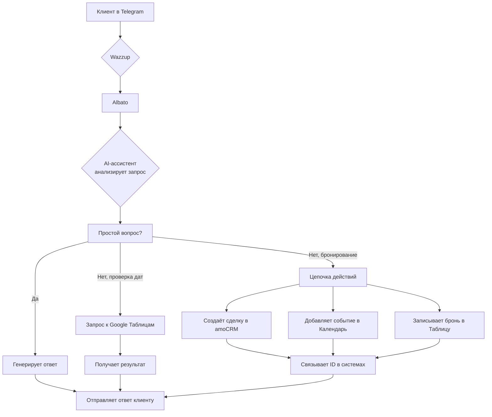

# villa-booking-autopilot
AI-бот для бронирования вилл в Telegram. Автоматизирует первичные продажи 24/7: отвечает на вопросы, проверяет даты, создаёт брони в amoCRM и Google Календаре. No-code решение на Albato + OpenAI. Увеличивает конверсию на 40% и прибыль на 20-35%. Полная интеграция с Wazzup, Google Sheets, amoCRM.

# 🏡 AI-менеджер для бронирования вилл в Крыму
**Автоматизация первичных продаж, которая увеличивает прибыль на 20-35%**

> **Не теряйте больше ни одного лида. Запустите авто-менеджера за выходные.** ⚡

---

## 📌 Навигация
- [💰 Рост прибыли и ключевые метрики](#-рост-прибыли-и-ключевые-метрики)
- [🤖 Что это такое?](#-что-это-такое)
- [😫 Проблемы, которые мы решаем](#-проблемы-которые-мы-решаем)
- [🚀 Результат после внедрения](#-результат-после-внедрения)
- [🧠 Принцип работы за 60 секунд](#-принцип-работы-за-60-секунд)
- [🎬 Пример диалога в Telegram](#-пример-диалога-в-telegram)
- [✅ Функционал бота](#-функционал-бота)
- [🔗 Готовые интеграции](#-готовые-интеграции)
- [👥 Целевая аудитория](#-целевая-аудитория)
- [🛠️ Техническая реализация](#️-техническая-реализация)
- [📦 Состав пакета](#-состав-пакета)
- [⚡ Быстрый старт](#-быстрый-старт)
- [❓ Частые вопросы](#-частые-вопросы)
- [📈 Дорожная карта](#-дорожная-карта)
- [💬 Контакты](#-контакты)

---

## 💰 Рост прибыли и ключевые метрики
**Как эта автоматизация напрямую влияет на вашу выручку:**

| Показатель | До | После | Влияние на прибыль |
| :--- | :--- | :--- | :--- |
| **Конверсия лида в бронь** | 10-15% | **25-40%** | **Прямой рост выручки на 15-25%** за счёт мгновенного ответа |
| **Обработка лидов в нерабочее время** | 0% (потери) | **100%** (ботами) | **+10-20% к месячной выручке** от ночных/выходных клиентов |
| **Средний чек** | Не меняется | **+5-10%** | Бот предлагает варианты и апселлы, увеличивая средний чек |
| **Операционные затраты на менеджмент** | 100% (оклад) | **~30%** (подписки) | **Экономия 70% на ФОТ** + 20-30 часов времени менеджеров в неделю |
| **Ошибки при бронировании** | 3-5 в месяц | **0** | **Сохранённые нервы и деньги**, защита репутации |

**Итоговый расчётный эффект на прибыль: +20% до +35% к ежемесячной чистой операционной прибыли.**

> **👉 Хватит терять деньги. Переходите к [Быстрому старту](#-быстрый-старт) и начните настройку.**

---

## 🤖 Что это такое?
**Готовое решение для автоматизации первичных продаж в сфере аренды жилья.** Это не просто чат-бот, а **связка AI-ассистента, CRM и систем учёта**, которая:
*   **Полностью ведёт диалог** с потенциальным гостем в Telegram
*   **Автоматически проверяет доступность** домов в Google Таблицах
*   **Самостоятельно создаёт предварительные брони** с синхронизацией между amoCRM, Google Календарём и таблицами
*   **Работает 24/7**, превращая ночные и выходные запросы в деньги

**Техническая основа:** No-code платформа **Albato** как оркестратор, **AI (OpenAI)** как «мозг», **Google Workspace** как база данных, **amoCRM** как финальная точка учёта.

> **🚀 Хотите так же? Все инструкции и файлы — внизу. [Смотреть состав пакета](#-состав-пакета).**

---

## 😫 Проблемы, которые мы решаем
*   **Потеря лидов из-за медленного ответа** (>5 минут = -50% конверсии)
*   **Ошибки менеджеров** при ручной проверке дат → двойные брони, конфликты
*   **Высокие операционные расходы** на зарплату менеджера для круглосуточной работы
*   **Хаос в учёте:** брони в чатах, заметках, головах, но не в единой системе
*   **Невозможность масштабироваться** — больше домов = больше хаоса и ошибок

**Если вы узнали свою ситуацию — действуйте. Решение есть.**

---

## 🚀 Результат после внедрения
*   **Утро** – открываете **Google Календарь** и видите наглядную картину загрузки всех домов. 2-3 новые брони, сделанные ночью, уже там
*   **День** – менеджеры работают только с **горячими клиентами** (те 10-15%, которых бот записал на консультацию). Делают **на 50% больше полезных действий**
*   **Вечер и ночь** – бот **сам отвечает** на вопросы, **сам проверяет** даты и **сам принимает** предварительные брони. Вы спите спокойно
*   **Итог недели** – в **amoCRM** полный порядок: каждый контакт, каждая сделка, все истории диалогов. **Конверсия из запроса в бронь выросла до 40%**

---

## 🧠 Принцип работы за 60 секунд

## ✅ Функционал бота

| № | Функция | Что делает | Эффект для бизнеса |
|---|---------|------------|-------------------|
| 1 | **Ответы на вопросы (FAQs)** | Автоматически отвечает на стандартные вопросы: цены, локация, удобства, правила проживания | Экономит **до 70% времени** менеджеров на рутинные ответы |
| 2 | **Определение намерений** | Анализирует, клиент «просто смотрит» или готов бронировать | Фокусирует внимание команды на **горячих лидах** |
| 3 | **Фильтрация нецелевых** | Отсеивает случайных пользователей и «просто посмотреть» | **Сохраняет 20-30 часов/мес** времени менеджеров |
| 4 | **Показ каталога** | Демонстрирует варианты домов с фото, описанием, ценами | **Увеличивает средний чек** за счёт сравнения вариантов |
| 5 | **Проверка доступности** | Мгновенно проверяет свободные даты в Google Таблицах | **Устраняет главную боль** — ошибки бронирования |
| 6 | **Запись на консультацию** | Создаёт сделку и контакт в amoCRM для передачи менеджеру | **Ни один лид не теряется**, полная история в CRM |
| 7 | **Предварительное бронирование** | Создаёт сделку в amoCRM + событие в Календаре + запись в Таблице | **Автоматизирует 90% процесса** бронирования |
| 8 | **Синхронизация данных** | Связывает все системы: amoCRM ↔ Календарь ↔ Таблицы | **Исключает человеческий фактор**, полный порядок в данных |

---

## 🔗 Готовые интеграции

| Сервис | Для чего | Статус |
|--------|----------|--------|
| **Telegram + Wazzup** | Основной канал общения с гостями, приём сообщений | ✅ Готово |
| **Albato** | No-code платформа — мозг автоматизации, оркестрация всего процесса | ✅ Готово |
| **AI (OpenAI/GPT)** | Понимание естественного языка, генерация персонализированных ответов | ✅ Готово |
| **Google Таблицы + Apps Script** | База данных броней, проверка доступности дат, логика бронирования | ✅ Готово |
| **Google Календарь** | Визуальное расписание для команды, наглядная картина загрузки домов | ✅ Готово |
| **amoCRM** | Единая CRM-система для хранения лидов, сделок, контактов и истории | ✅ Готово |

> **Вам не нужно ничего придумывать — только подключить ваши аккаунты.**

---

## 👥 Целевая аудитория

| Профиль | Проблема | Решение |
|---------|----------|---------|
| **Владелец агентства в Крыму** | Хаос в бронированиях, зависимость от менеджеров, упущенные лиды | Полная автоматизация первичных продаж, единая система учёта |
| **Управляющий 10+ объектами** | «Человек-органайзер» — всё в голове и чатах, постоянные ошибки | Централизованная система, синхронизация данных, 24/7 работа |
| **Команда из 1-2 менеджеров** | Тонут в рутине, не успевают обрабатывать запросы, выгорание | Освобождение от 70% рутины, работа только с готовыми клиентами |
| **Стартап в гостеприимстве** | Нужно быстро масштабироваться без увеличения штата, важны процессы | Готовая экосистема с первого дня, профессиональный имидж |

---

## 🛠️ Техническая реализация

### Архитектура системы

👤 **Клиент** → 📱 **Telegram** → 💬 **Wazzup** → ⚙️ **Albato** → 🧠 **AI** → ⚡ **Действие** → 📊 **[Google Sheets / 📅 Calendar / 🗂️ amoCRM]** → ✅ **Ответ клиенту**

### Ключевые артефакты (находятся в репозитории)

| Артефакт | Назначение | Где искать |
|----------|------------|------------|
| **1. Системный промпт для AI** | Инструкция для нейросети: поведение, тон, логика | `/prompts/system_prompt.md` |
| **2. Apps Script для Google Sheets** | Скрипт проверки доступности дат и записи брони | `/scripts/google_sheets_apps_script.js` |
| **3. Схема автоматизации для Albato** | JSON-файл для импорта всей цепочки | `/albato/automation_flow.json` |
| **4. Скриншоты работы** | Интерфейс бота, настройки нод, календарь | `/screenshots/` |
| **5. Шаблон Google Таблицы** | Структура таблицы для учёта бронирований | `/templates/booking_template.xlsx` |

---

## ⚡ План запуска

**Система настраивается в 5 ключевых этапов за 4-6 часов:**

| Этап | Что делать | Ключевые действия | Время |
|------|------------|-------------------|-------|
| **1. Подготовка** | Создать базовые компоненты | • Создать Telegram-бота • Скачать файлы из репозитория • Создать копии Google Таблицы и Календаря из `/templates` | ~1 час |
| **2. Настройка Albato** | Развернуть автоматизацию | • Импортировать схему из `/albato/automation_flow.json` • Настроить триггеры и действия в конструкторе | ~1 час |
| **3. Подключение сервисов** | Интегрировать все системы | • Telegram-бот → Wazzup • Wazzup → Albato • amoCRM → Albato • Google Sheets → Albato • Google Calendar → Albato | ~1.5 часа |
| **4. Настройка AI-ассистента** | Создать и обучить GPT-ассистента | **Шаг 4.1:** Создать ассистента в OpenAI Playground **Шаг 4.2:** Взять наш системный промпт из `/prompts/system_prompt.md` и адаптировать под ваш бизнес **Шаг 4.3:** Разработать свою базу знаний (правила, FAQ, политики) **Шаг 4.4:** Создать каталог объектов на основе нашего шаблона (сохраняя названия столбцов) **Шаг 4.5:** Конвертировать каталог в JSON-формат **Шаг 4.6:** Загрузить промпт, базу знаний и каталог в ассистента | ~2 часа |
| **5. Тестирование** | Проверить работу | • Протестировать диалоги в Telegram • Проверить создание броней в таблице • Убедиться в синхронизации с календарём и CRM | ~1-2 часа |

**💡 Ключевые моменты:**
- **AI-ассистент:** Создаётся отдельно в OpenAI Playground, не в Albato
- **Каталог объектов:** Должен сохранять структуру столбцов для корректной работы Apps Script
- **JSON-формат:** Каталог конвертируется для загрузки в ассистента
- **База знаний:** Ваш уникальный набор правил, FAQ и политик
